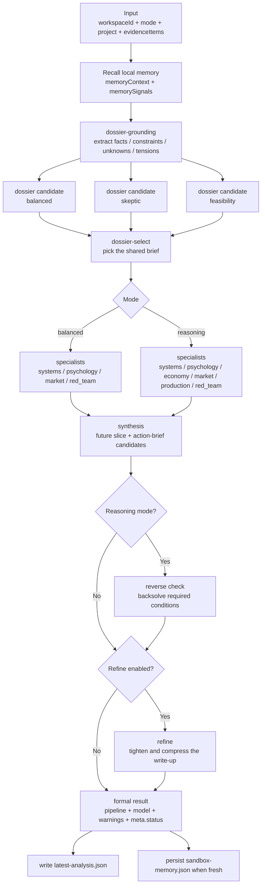

# DeltaArc

[English](./README.en.md) | [中文](./README.md)

> Turn vague game ideas into testable design decisions.

DeltaArc is not a generic project board, not a chat toy, and not a “generate one polished report and call it done” app.

It is a local simulation workbench for game and interactive product design.  
You feed in project context and evidence, run a formal analysis, freeze that result into a baseline, then inject one new variable and inspect what it changes first, which risks it amplifies, and which guardrails should come before implementation.

You can take a vague gameplay idea, system change, live-ops concept, or monetization proposal and push it through a clear decision chain:

> enter project and evidence -> run formal analysis -> freeze a baseline -> inject one new variable -> inspect direct impact, risks, guardrails, and validation actions

The point is not to ask whether an idea sounds cool. The point is to answer harder questions:

- Is this idea worth continuing right now
- If we build it, what will break first
- Which guardrails and validation steps should come before implementation
- Should we prototype this now, tighten the scope, or stop and fix the baseline first

This repository already contains the first complete variable-sandbox loop.  
Project intake, formal analysis, baseline freezing, lightweight variable injection, impact scan, and result review now work inside the current flow.

## Why This Might Be Worth Your Attention

- It does not restart from an empty prompt every time. It freezes a formal baseline and keeps reasoning from there.
- It does not only output a conclusion. It exposes stages, status, warnings, retries, and saved runs so the process stays inspectable.
- It is not trying to solve every “AI for games” problem. It is focused on one question: what happens if you change one thing in this design?
- It is local-first, which makes it a better fit for private design docs, playtest notes, and internal direction calls.

## In 30 Seconds

- Audience: game designers, system designers, and interactive product teams
- Strongest current use case: a first-pass structured judgment on whether a mechanic or system idea should move forward
- Current flow: `overview -> evidence -> inference desk -> modeling -> strategy -> report -> sandbox`
- Current shape: local-first, three-phase workflow (`intake -> analysis -> outputs`), visible execution progress, persistent results and baselines
- Next step: multi-variable interplay, branch simulation, reverse reasoning, and historical comparison

## Current Status

### Ready To Use

- Project and evidence workbench
  - Manual project editing
  - Import `.json`, `.md`, `.markdown`, and `.txt`
  - Split structured files into `project + evidence` inside the workspace
- Two formal analysis modes
  - `Quick Scan`, mapped to `balanced`
  - `Deep Dive`, mapped to `reasoning`
- Workspace recovery and retry
  - Persist the latest formal analysis by workspace
  - Restore the latest active analysis job
  - Resume from retryable failed stages
- Visible execution progress
  - Stage, stage status, model info, degraded fallback info, and warnings
  - Pollable progress instead of a black-box wait
- Structured formal outputs
  - `perspectives`
  - `blindSpots`
  - `scenarioVariants`
  - `futureTimeline`
  - `validationTracks`
  - `redTeam`
  - `report`
- Baseline freezing
  - Freeze the latest formal analysis into a reusable baseline
  - Persist baselines locally so they do not depend on in-memory jobs staying alive
- First variable-sandbox loop
  - Enter a new idea inside the dedicated `Variable Sandbox`
  - Let the system draft a structured variable
  - Run one impact scan and get direct effects, affected groups, guardrails, and validation advice
  - Restore the latest unfinished scan and reopen saved scan history
- Persistent truth sources
  - Latest formal analyses, frozen baselines, variables, and impact scans are written to disk
  - Key signals from successful runs also persist to `server/data/sandbox-memory.json`

### Best Next Builds

- Multi-variable interaction instead of one variable at a time
- Branch simulation and turn-based progression beyond a single impact scan
- Reverse reasoning from target outcomes back to required conditions
- Better baseline, variable, and historical comparison views

## A Typical Use Case

Imagine you are building a co-op prototype and considering one design change:

> “Add timed two-player gates in the mid-game to increase cooperative highlights and shareable moments.”

In DeltaArc, the flow becomes:

1. Import the project bundle, design notes, playtest observations, and competitor evidence.
2. Run one formal analysis to understand current fun, learning cost, core risk, and next validation moves.
3. Freeze that result into a `baseline`.
4. Inject the new “timed two-player gate” variable.
5. Run one impact scan and inspect what changes first:
   - does co-op payoff really go up
   - do solo players get punished too early
   - do teaching and fallback systems become mandatory
   - is this variable worth prototyping, or should it be narrowed first

That is the current promise of DeltaArc:

- not to replace your judgment
- but to help you see where a design change is likely to fail before you pay full production cost

The public repository keeps guides, roadmap notes, fixtures, and implementation code.  
Detailed design specs stay local under `docs/specs/` and are intentionally excluded from GitHub; runtime workspace data also stays local under `server/data/projects/`.

## Stack

- Frontend: `React 18` + `Vite` + `TypeScript`
- Backend: `Express` + `TypeScript` + `tsx`
- Shared layer: domain models, schemas, request types, and result types under `shared/`
- Runtime model: frontend dev server + separate API server; production build served by Node with static assets

## Repository Layout

```text
.
├─ src/                             # Frontend application
│  ├─ api/                          # Backend API wrappers
│  ├─ components/
│  │  ├─ analysis/                  # Result panels, progress, timeline, prediction graph
│  │  ├─ import/                    # File import UI
│  │  ├─ layout/                    # Workspace header and layout
│  │  ├─ project/                   # Project editing cards
│  │  ├─ ui/                        # Lightweight UI primitives
│  │  └─ variableSandbox/           # Variable editor and impact-scan panels
│  ├─ data/                         # Local mock/static data
│  ├─ hooks/                        # Project, analysis, baseline, and scan state
│  ├─ lib/
│  │  ├─ import/                    # JSON / Markdown import parsing and normalization
│  │  ├─ jobProgress.ts             # Job progress mapping
│  │  └─ workflowSteps.ts           # Workflow step definitions
│  ├─ app/                          # Workspace orchestration and page composition
│  ├─ pages/                        # overview / evidence / modeling / strategy / report / variable sandbox
│  ├─ styles/                       # Global styles, layout, and page styles
│  ├─ App.tsx                       # Main workspace entry
│  ├─ main.tsx                      # React mount entry
│  └─ types.ts                      # Frontend view types
├─ server/                          # Backend service
│  ├─ routes/
│  │  ├─ sandbox.ts                 # /api/sandbox route entry
│  │  └─ sandbox/                   # analysis / workspace / impact-scan handlers
│  ├─ lib/
│  │  ├─ analysisJobStore.ts        # In-memory async job storage
│  │  ├─ impactScanJobStore.ts      # Variable impact-scan job storage
│  │  ├─ projectTruthStore.ts       # Latest analysis / baseline / scan persistence
│  │  ├─ variableImpactScan.ts      # Variable impact-scan logic
│  │  └─ orchestration/             # Execution plans, prompts, fallback, stage previews
│  ├─ data/
│  │  └─ sandbox-memory.json        # Lightweight memory data
│  ├─ config.ts                     # Environment, timeout, and concurrency config
│  └─ index.ts                      # Express entry
├─ shared/                          # Shared frontend/backend models
│  ├─ sandbox.ts                    # Formal analysis task and result types
│  ├─ variableSandbox.ts            # Baseline and variable-sandbox protocol
│  └─ schema/                       # Runtime parsing, validation, and fallback
├─ docs/                            # Public guides, quality plans, and roadmap notes
│  └─ ...
├─ examples/                        # Example inputs, requests, baselines, variables, and scans
│  ├─ baselines/
│  ├─ impact-scans/
│  ├─ requests/
│  ├─ variables/
├─ scripts/                         # Development helper scripts
├─ dist/                            # Frontend build output
└─ dist-server/                     # Backend build output
```

## Current Architecture

### Frontend Workbench

- `src/app/` orchestrates the three-phase workflow: intake, inference desk, and outputs
- `src/app/useWorkspaceController.ts` coordinates workspace state, freshness, and page-level actions
- `src/hooks/useProject.ts` and `src/hooks/useEvidence.ts` manage project and evidence inputs
- `src/hooks/useSandboxAnalysis.ts` starts formal analysis jobs, restores the latest active job, and polls results
- `src/hooks/useBaselineLibrary.ts` loads the latest analysis and frozen baselines for the workspace
- `src/hooks/useVariableImpactScan.ts` starts, restores, and polls variable impact scans and loads saved scan history
- `src/pages/VariableSandboxPage.tsx` is the dedicated Step 5 variable-sandbox view
- Components under `src/components/analysis/` and `src/components/variableSandbox/` render execution progress, formal outputs, and variable-sandbox results

### Backend Analysis Pipeline

- `server/routes/sandbox.ts` assembles analysis, workspace, and impact-scan routes
- `server/routes/sandbox/analysisHandlers.ts`
  - creates formal analysis jobs
  - exposes polling
  - supports retryable stage resume
  - exposes latest-active and latest-retryable workspace job queries
- `server/routes/sandbox/workspaceHandlers.ts`
  - serves latest formal analysis, baselines, and workspace clearing
- `server/routes/sandbox/impactScanHandlers.ts`
  - creates impact-scan jobs
  - exposes latest-open, history, and saved scan retrieval
- `server/lib/orchestration/`
  - builds formal analysis execution plans
  - runs stage-by-stage LLM calls
  - handles degraded fallbacks
  - prepares progress previews for the UI
- `server/lib/projectTruthStore.ts`
  - persists latest formal analyses
  - freezes baselines
  - stores variables and impact-scan results by workspace

### Shared Types And Schemas

- `shared/domain.ts` defines project, evidence, persona, and strategy objects
- `shared/sandbox.ts` defines formal analysis modes, stages, jobs, and results
- `shared/variableSandbox.ts` defines baselines, variables, impact-scan jobs, and result types
- `shared/schema/` owns runtime parsing, validation, normalization, and fallback helpers

## Current Runtime Flow

1. The frontend submits `project + evidenceItems + mode` to `POST /api/sandbox/analyze`
2. The backend creates an in-memory formal-analysis job and immediately returns `202 Accepted`
3. The frontend polls `GET /api/sandbox/analyze/:jobId`
4. The backend runs:
   - `dossier`
   - `specialists`
   - `synthesis`
   - `refine`
5. Each stage writes back status, model info, previews, and timing
6. The final formal result returns to the frontend and is also written into `server/data/projects/<workspaceId>/latest-analysis.json`
7. Fresh runs additionally contribute key signals into `server/data/sandbox-memory.json`

### Current Phase 1 Reasoning Flow

Phase 1 here means the formal-analysis pipeline that runs before the variable sandbox.



- `dossier` is not a single one-shot pass anymore. It runs as `grounding -> multi-candidate -> selector`, and falls back to the legacy one-pass dossier path only when the split path fails.
- `specialists` consume both `PROJECT` and `DOSSIER`; if dossier content conflicts with the raw project input, the raw project wins.
- Completed specialist stages are cached as checkpoints, so later failures can `resume / retry` from completed work instead of rerunning everything.
- Any JSON repair, fallback handling, or partial preservation marks the final result as `degraded`; if `refine` fails, the synthesis draft is still kept for recovery.

### Variable Sandbox Flow

1. The frontend freezes the latest formal analysis into a baseline
2. The user enters one new idea in `Variable Sandbox` and the system drafts a structured variable
3. The frontend submits `baselineId + variable + mode` to the impact-scan endpoint
4. The backend reads the frozen baseline and runs one impact scan
5. The result returns to the frontend and is also persisted under the workspace `variables/` and `impact-scans/` directories
6. Reopening the same baseline lets the UI restore the latest unfinished scan or load saved scan history

## Local Development

### 1. Install Dependencies

```bash
npm install
```

### 2. Configure Environment Variables

Copy `.env.example` to `.env.local` and at minimum fill in `DEEPSEEK_API_KEY`:

```env
DEEPSEEK_API_KEY=
DEEPSEEK_BASE_URL=https://api.deepseek.com
DEEPSEEK_CHAT_MODEL=deepseek-chat
DEEPSEEK_REASONING_MODEL=deepseek-reasoner
LLM_BALANCED_TIMEOUT_MS=60000
LLM_REASONING_TIMEOUT_MS=150000
LLM_BALANCED_SPECIALIST_CONCURRENCY=3
LLM_REASONING_SPECIALIST_CONCURRENCY=4
LLM_ENABLE_REASONING_REFINE_STAGE=false
PORT=5001
```

### 3. Start Development

Run frontend and backend together:

```bash
npm run dev:full
```

Or run them separately:

```bash
npm run dev
npm run dev:server
```

Default addresses:

- Frontend: `http://127.0.0.1:3000`
- Backend: `http://127.0.0.1:5001`

During development, open the frontend address directly. `npm run dev:server` is API-only and no longer falls back to serving an old `dist/` build.

### 4. Build And Run Production

```bash
npm run build
npm start
```

Notes:

- `npm run build:client` writes `dist/`
- `npm run build:server` writes `dist-server/`
- `dist-server/server/index.js` serves frontend static assets when `dist/` exists

## Common Scripts

- `npm run dev`
- `npm run dev:server`
- `npm run dev:full`
- `npm run build`
- `npm start`
- `npm run typecheck`
- `npm test` runs import, workspace-state, job-store, orchestration, truth-store, variable-sandbox, and schema tests
- `npm run verify:fixtures`
- `npm run preview`

## Current API

### Formal Analysis

- `GET /api/health`
- `POST /api/sandbox/analyze`
- `GET /api/sandbox/analyze/:jobId`
- `POST /api/sandbox/analyze/:jobId/retry`

### Truth Store And Baselines

- `GET /api/sandbox/workspaces/:workspaceId/latest-analysis`
- `GET /api/sandbox/workspaces/:workspaceId/latest-active-job`
- `GET /api/sandbox/workspaces/:workspaceId/latest-retryable-job`
- `GET /api/sandbox/workspaces/:workspaceId/baselines`
- `GET /api/sandbox/workspaces/:workspaceId/baselines/:baselineId`
- `POST /api/sandbox/workspaces/:workspaceId/baselines`
- `DELETE /api/sandbox/workspaces/:workspaceId`

### Variable Impact Scan

- `GET /api/sandbox/workspaces/:workspaceId/impact-scans/latest-open`
- `GET /api/sandbox/workspaces/:workspaceId/impact-scans`
- `POST /api/sandbox/workspaces/:workspaceId/impact-scans`
- `GET /api/sandbox/workspaces/:workspaceId/impact-scans/:jobId`

## Docs And Examples

- [Chinese README](./README.md)
- [Upload Guide](./docs/document-upload-guide.md)
- [Phase 1 Analysis Quality Plan](./docs/first-stage-analysis-quality-plan.md)
- [Roadmap](./docs/next-phase-roadmap.md)
- [AI Refactor Checklist](./docs/ai-coding-refactor-checklist.md)
- [Markdown Import Example](./examples/coop-camp-upload-sample.md)
- [JSON Import Example](./examples/project-bundle-upload-sample.json)
- [Additional Project Bundle Example](./examples/yihuan-project-bundle.json)
- [Frozen Baseline Fixture](./examples/baselines/valid-frozen-baseline.json)
- [Variable Fixture](./examples/variables/valid-design-variable-v1.json)
- [Impact Scan Request Fixture](./examples/impact-scans/valid-impact-scan-request.json)
- [Impact Scan Result Fixture](./examples/impact-scans/valid-impact-scan-result.json)
- [Request Fixture](./examples/requests/valid-analysis-request.json)
- [Result Fixture](./examples/expected/degraded-analysis-result.json)

Note:

- Detailed design docs and drafts stay local under `docs/specs/` and are intentionally excluded from the GitHub repository.
- Runtime workspace data still stays local under `server/data/projects/` and is not meant to be committed.

## Windows / PowerShell UTF-8 Note

This repository includes Chinese source files, docs, prompts, and fixtures. In PowerShell, if output looks garbled, run:

```powershell
& "$PWD\scripts\agent-utf8-bootstrap.ps1"
```

Then read files with `Get-Content -Encoding utf8` so console encoding issues are not mistaken for file corruption.

## Current Boundaries

- Remote formal analysis still depends on DeepSeek configuration
- `Quick Scan` and `Deep Dive` share the same async job mechanism but run different execution plans
- Formal-analysis and impact-scan job state is still in-memory, not a durable queue
- The current variable sandbox is a focused first loop; the Phase 2 multi-branch simulation plan is documented but not yet implemented
- Tests cover parsing, workspace state, job stores, orchestration, persistence, and fixtures, not full end-to-end product regression
