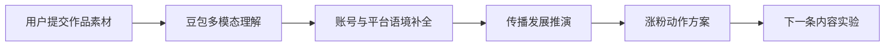

# 第五赛道社媒增长 Agent 设计文档

## 作品定位

作品名称：KOC Growth Lab

赛道：AI + 社媒流量密码，帮普通 KOC 轻松涨粉

一句话：用户提交自己的内容作品、账号信息和目标平台，系统用豆包多模态模型理解素材，并推演这条内容的传播发展、粉丝增长机会和下一步运营动作。

## 目标用户

- 普通 KOC、校园创作者、社团运营同学。
- 有内容创作意愿，但不知道选题、封面、文案、发布时间、互动策略怎么做的人。
- 已经有图文、视频截图、脚本或账号主页素材，想知道怎么优化涨粉的人。

## 核心问题

普通 KOC 的困难不是“不会写一条文案”，而是：

- 看不清自己的内容会吸引谁。
- 不知道平台为什么推、推给谁、哪里会跑偏。
- 不会把一次发布拆成可持续增长动作。
- 看到数据后不知道下一条内容怎么迭代。

## 核心体验

用户提交作品素材后，系统输出一份“传播发展推演”：

1. 内容理解：豆包多模态识别图片、封面、画面文字、人物/物件/场景、情绪氛围。
2. 账号理解：读取用户输入的账号定位、粉丝画像、平台、历史表现。
3. 传播推演：模拟内容从核心粉丝、泛兴趣用户、误推用户到潜在新粉的扩散路径。
4. 增长剧本：给出标题、封面、评论区、发布时间、互动话术、下一条选题。
5. 迭代实验：把建议拆成 3 个低成本 A/B 测试，帮助用户继续涨粉。

## 非目标

- 不承诺真实播放量、点赞量、涨粉数。
- 不做刷量、诱导互动、违规引流。
- 不替用户自动发布内容。
- MVP 不接入真实平台账号 OAuth，也不读取私域数据。

## 产品主流程

## 输入设计

### 必填

- 目标平台：小红书、视频号、抖音、B站、微博、通用平台。
- 账号定位：例如校园生活、学习效率、社团活动、娱乐吐槽。
- 本次作品目标：涨粉、评论互动、收藏、私信咨询、活动报名。
- 内容标题或开头钩子。
- 正文、脚本或口播稿。

### 可选

- 上传封面图、图文截图、视频关键帧、账号主页截图。
- 目标受众。
- 历史表现：平均浏览、点赞、评论、涨粉。
- 品牌/个人边界：不能说什么、不能碰什么。

## 输出设计

### 1. 多模态内容读片

- 画面主体
- 画面文字
- 第一眼情绪
- 可能被误读的地方
- 首屏停留分

### 2. 传播发展推演

- 第 0-2 小时：核心粉丝怎么反应。
- 第 2-12 小时：平台可能把内容推给哪些泛兴趣人群。
- 第 12-48 小时：评论区会出现什么分歧、误读或二创机会。
- 第 48 小时后：是否值得追更、复盘或改成系列。

### 3. 用户分层

- 核心粉丝：为什么愿意关注。
- 泛兴趣用户：为什么会点进来但不一定关注。
- 路过用户：为什么会划走。
- 潜在新粉：什么信号会触发关注。

### 4. 涨粉动作

- 标题优化
- 封面优化
- 前 3 秒脚本
- 评论区置顶话术
- 发布时间建议
- 下一条内容选题

### 5. 实验计划

- A/B 标题
- A/B 封面
- A/B 评论引导
- 复盘指标

## 豆包多模态链路

### 模型角色

- Vision 输入：图片、封面、截图、视频关键帧。
- Text 输入：平台、账号定位、作品标题、正文、脚本、用户目标。
- 输出：结构化 JSON，前端渲染为读片、推演、策略和实验计划。

### Prompt 目标

模型不是“替用户写爆款文案”，而是扮演增长推演器：

- 先看懂素材。
- 再判断平台分发与用户反馈。
- 最后给出可执行动作。

### 结果约束

- 所有建议必须可执行。
- 必须保留风险和误读。
- 必须说明推演不等于真实流量承诺。
- 不输出刷量、欺骗、诱导关注等违规建议。

## 页面信息架构

### 首屏

- 产品名：KOC Growth Lab
- 标语：提交你的内容作品，让 AI 推演它如何涨粉
- 左侧：作品输入表单
- 右侧：传播推演预览

### 工作区

- 输入区：平台、账号定位、目标、正文/脚本、图片上传。
- 推演区：读片、用户分层、传播时间线、涨粉动作。
- 实验区：下一条内容计划和 A/B 测试。

## MVP 验收标准

- 用户可以填写平台、账号定位、作品目标、标题、正文/脚本。
- 用户可以上传一张图片作为封面或截图。
- 点击“开始推演”后，调用现有 preflight API 链路。
- mock provider 下可稳定返回 KOC 增长语义结果。
- Doubao provider 下可带图片调用多模态模型。
- 页面不再出现“比赛提交检查器”语义。
- Browser Use 可完成：加载页面、填充 demo、开始推演、查看结果、清空结果。

## 下一轮代码改造范围

- `src/pages/PreflightStudioPage.tsx`：改为 KOC Growth Lab 作品主界面。
- `src/styles/pages.css`：改为社媒增长工作台视觉。
- `server/lib/preflight/mockProvider.ts`：输出 KOC 涨粉推演结果。
- `server/lib/preflight/prompt.ts`：按社媒增长推演器重写 competition 分支或新增 growth 分支。
- `shared/preflightSimulation.ts`：必要时新增 `koc_growth_lab` 场景和 `follower_growth` 目标。
- `index.html`：标题改为 KOC Growth Lab。

## 风险

- 如果只输出文案建议，会显得像普通 AI 写作工具，需要强调“传播发展推演”和“下一条内容实验”。
- 如果不支持图片/截图输入，会弱化豆包多模态亮点。
- 如果建议过于绝对，会违反“不承诺真实流量”的边界。
